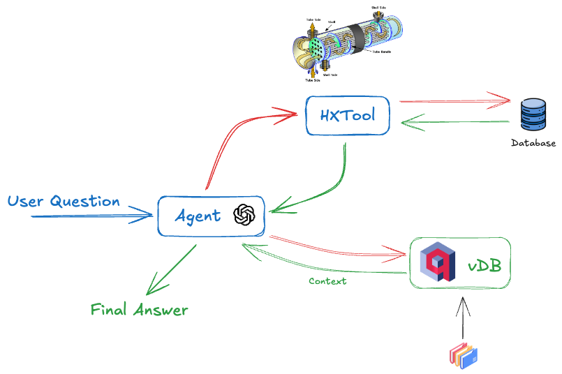

## Agent + RAG:

Este projeto consiste em um app de chatbot utilizando `streamlit`. O objetivo é permitir que o usuário possa consultar informações dinâmicas sobre os processos (*timeseries*) e em informações de documentos.

### Descritivo de arquitetura simplificado:

A Figura abaixo descreve a arquitetura utilizada par agestão de informações.

  

### Descrição dos Componentes:

1.	User Question: O usuário interage com o sistema enviando uma pergunta ou consulta.
2.	Agent: O agente atua como o componente central da arquitetura, responsável por interpretar a pergunta do usuário e orquestrar as interações com as demais ferramentas do sistema para gerar a resposta final. Ele é integrado ao back-end desenvolvido com LangChain, permitindo uma gestão eficiente do fluxo de informações e a comunicação com outras ferramentas.
3.	HXTool: Esta ferramenta acessa dados específicos do processo, possivelmente relacionados a medições e cálculos de trocadores de calor (HX). Ela está conectada ao Database, onde armazena e recupera informações técnicas e de processo.
4.	vDB: Representa um banco de dados vetorial (como Qdrant), utilizado para realizar buscas semânticas em documentos e informações textuais. O Agent pode enviar consultas para a vDB para obter contexto relevante para a resposta, processando dados não estruturados e documentos em linguagem natural.
5.	Database: Repositório de dados onde a HXTool armazena e recupera informações de processo.
6.	Final Answer: Após o Agent compilar e processar todas as informações coletadas da HXTool e do vDB, ele envia a resposta final para o usuário.

### Fluxo de Interação:

1.	O usuário envia uma pergunta ao Agent.
2.	O Agent consulta a HXTool e o vDB conforme necessário:

- A HXTool é utilizada para acessar dados técnicos e de processo.
  
- O vDB fornece contexto adicional de documentos para enriquecer a resposta.

3.	Após reunir o contexto e os dados necessários, o Agent compila e gera a Final Answer, retornando-a ao usuário.
